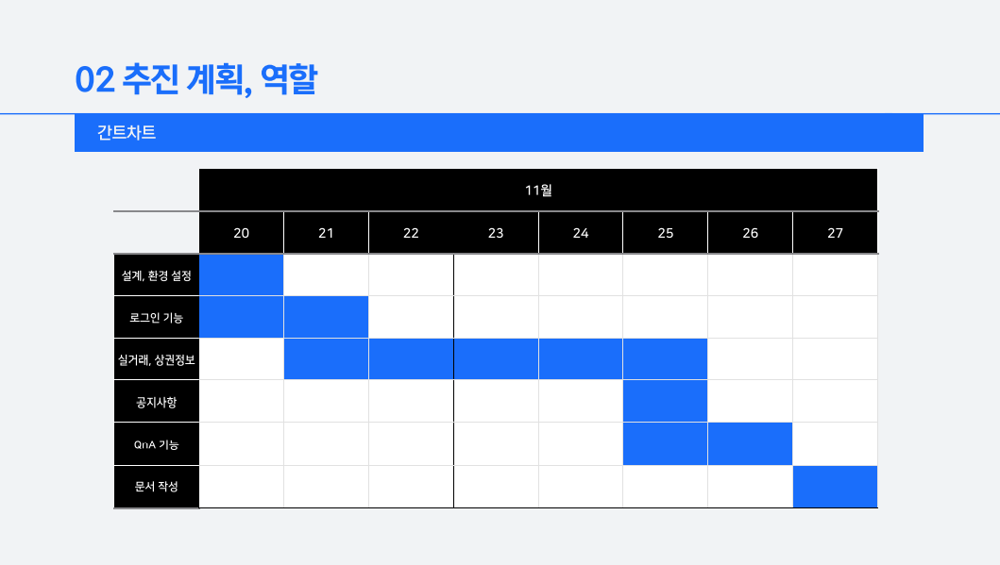
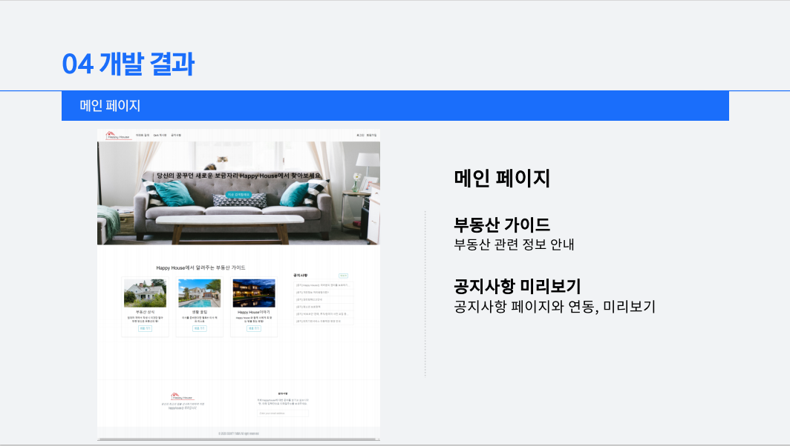
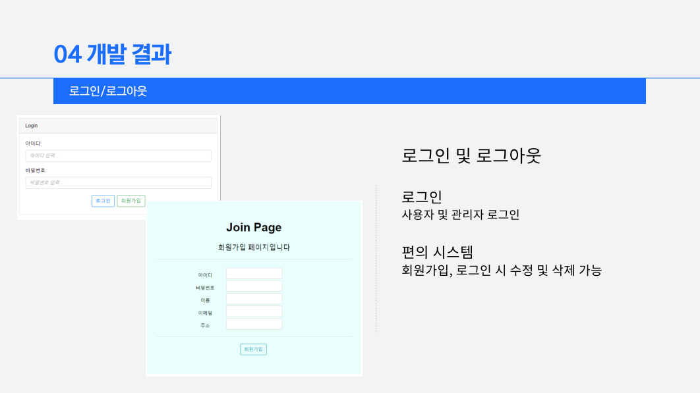
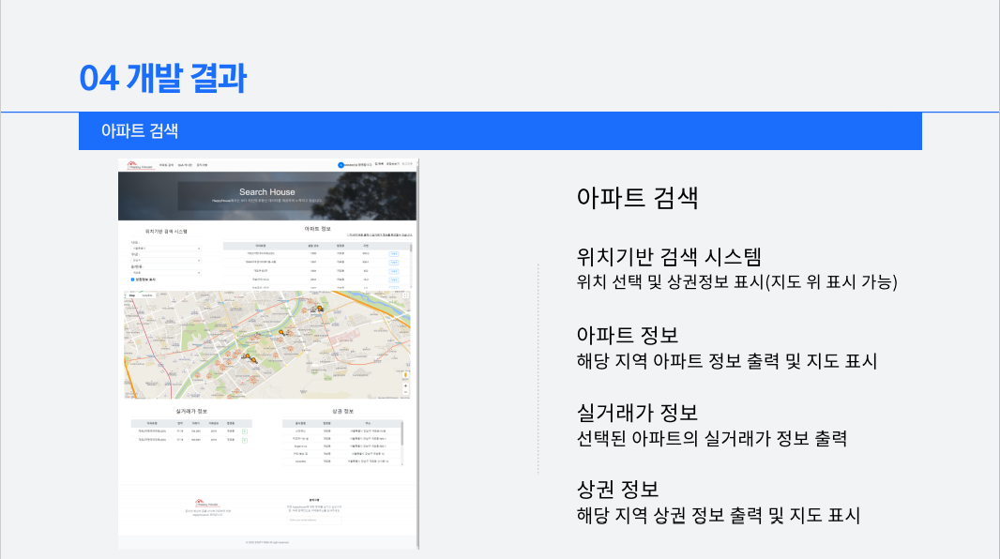
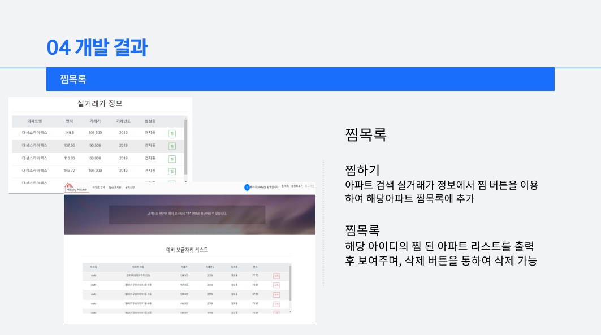
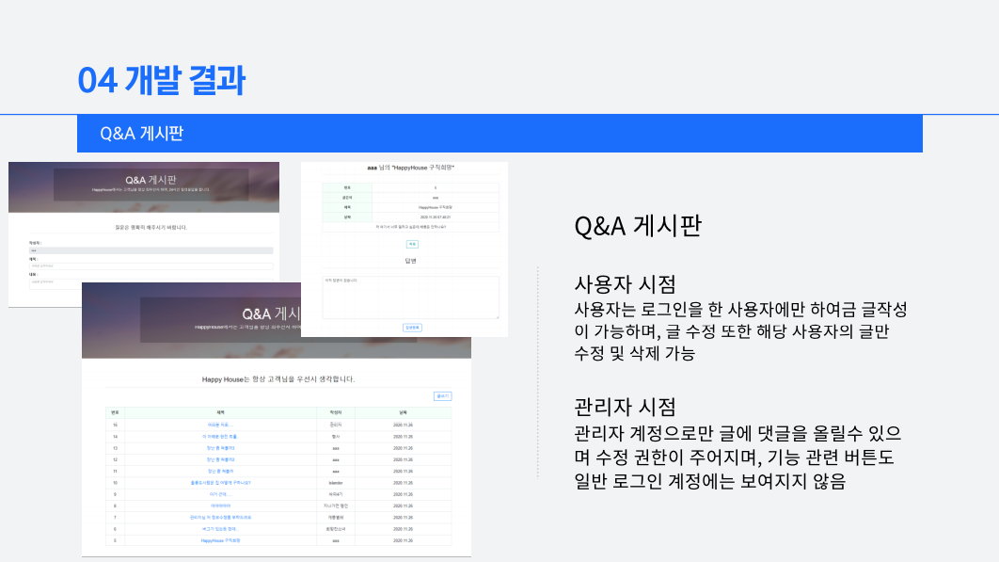
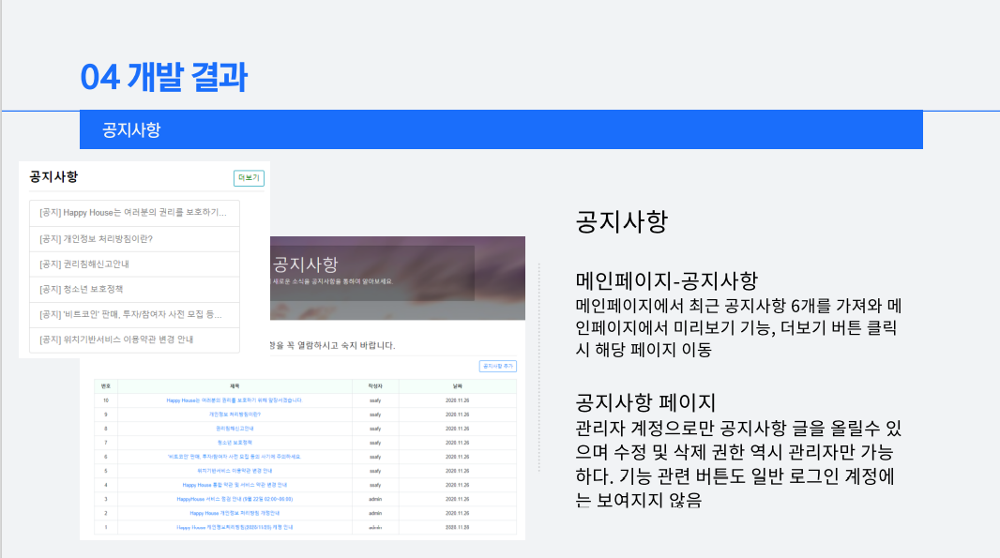
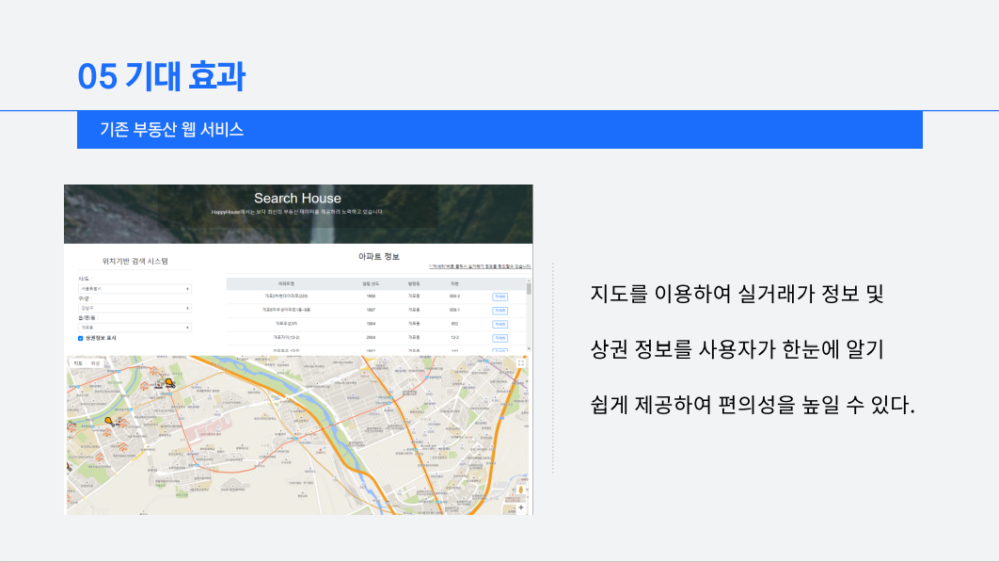

# HAPPY HOUSE

## 팀원 소개

| 역할 | 팀명   |
| ---- | ------ |
| BE   | 문진환 |
| FE   | 김세민 |

## 사용된 기술스택

> vue.js
> spring boot
> mysql

## 계획

> 2020.11.15 ~ 2020.11.27(2주)

## 기획배경

## 개발결과

> 메인화면

> 로그인 관련

> 아파트 검색

> 찜 목록 기능

> Q&A 게시판

> 공지사항

## 기대효과

## 개발 후기

